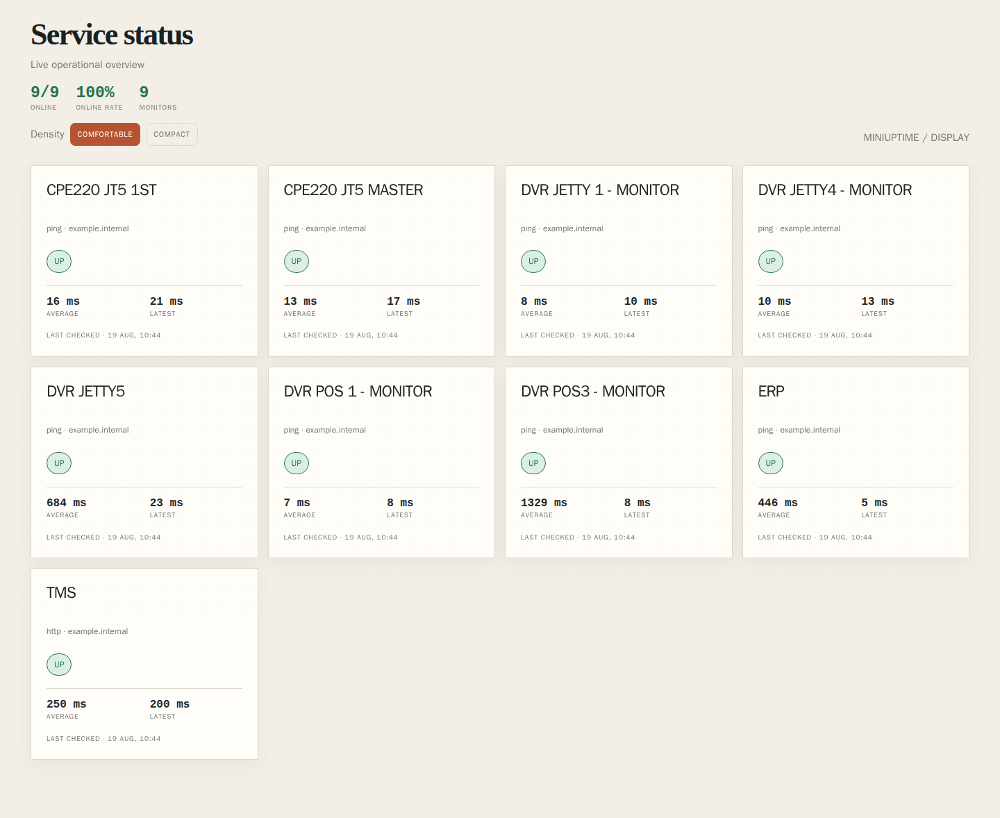
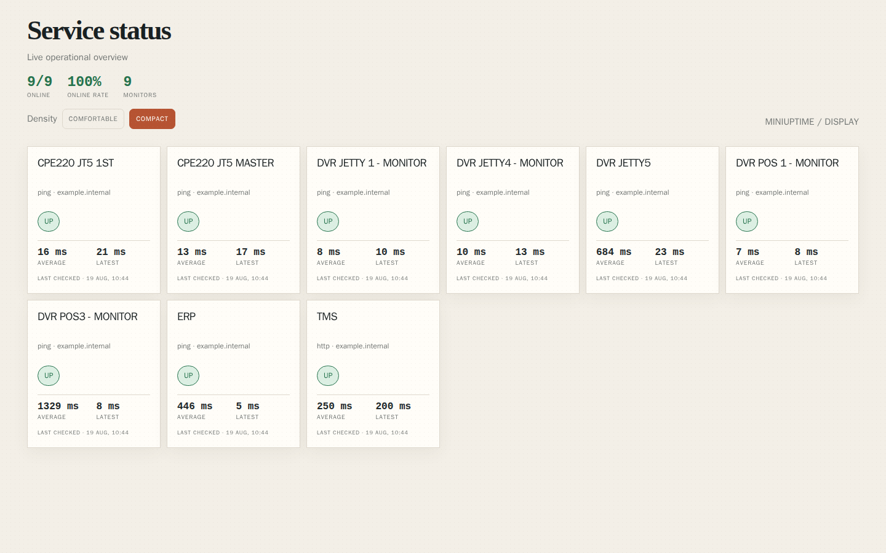

# MiniUptime

[](https://go.dev/)
[](https://hub.docker.com/r/baguskp2609/mini-uptime)

Lightweight, self-hosted uptime monitoring for HTTP endpoints, TCP services, and network devices.

MiniUptime is a single Go binary backed by SQLite and packaged as one small Docker Compose service. It includes an admin console for managing monitors and groups, plus a read-only NOC display for TVs and wallboards.

## Why MiniUptime

- One container, one binary, one SQLite database
- No Node.js, PostgreSQL, Redis, or separate frontend runtime
- HTTP, TCP, and ICMP Ping checks
- Live status updates through Server-Sent Events
- Incident tracking with recovery detection
- Optional rich Telegram alerts for DOWN and RECOVERED events
- Responsive admin UI and read-only display mode

## Features

### Monitoring

- Create, edit, pause, enable, and delete monitors
- HTTP URL, TCP `host:port`, and Ping hostname/IP validation
- Configurable check intervals
- Retry checks with bounded backoff
- Current status, latest latency, error, and last checked time
- Last 50 checks with average, P95, best, and worst latency

### Organization

- Create and delete monitor groups
- Assign monitors from the Groups page
- A monitor belongs to at most one group; assigning it elsewhere moves it
- Filter monitors and the public display by group

### Operations

- Dashboard summary and recent incidents
- Open and recovered incident history
- Optional Telegram notifications
- HTML-formatted Telegram alerts with group, latency, error, and downtime context
- `/display` read-only wallboard with:
  - Online count and online rate
  - Latest and average latency per monitor
  - Last checked time
  - DOWN-first ordering
  - Comfortable and Compact density modes
  - Public, disabled, or PIN-protected access

## Quick Start

### Requirements

- Docker Desktop or Docker Engine with Compose

### Run with Docker Compose

```bash
docker compose up -d --build
```

Open:

- Admin console: <http://localhost:3001>
- Health endpoint: <http://localhost:3001/health>

On first start, open the admin console and complete setup. Do not rely on credentials from development notes or examples.

### Run the prebuilt image

The latest image is available on Docker Hub:

<https://hub.docker.com/r/baguskp2609/mini-uptime>

```bash
docker volume create miniuptime-data
docker run -d \
  --name miniuptime \
  --restart unless-stopped \
  --cap-add NET_RAW \
  -p 3001:3000 \
  -v miniuptime-data:/app/data \
  baguskp2609/mini-uptime:v1.0.0
```

Use `baguskp2609/mini-uptime:latest` when you explicitly want the rolling image.

### Stop

```bash
docker compose down
```

Monitor data is stored in `./data`. Back up this directory before upgrades or database maintenance.

## Screenshots

The main workflows are designed for both desktop administration and wallboard display.

### Display wallboard

Comfortable mode keeps the monitor cards spacious and readable from a nearby screen.



### Compact display

Compact mode fits more monitors into a single wallboard view.



## Configuration

The default timezone is `UTC` and can be changed from **Settings** using an IANA timezone such as `Asia/Jakarta`. Compose exposes the app at host port `3001`.

Optional Telegram alerts can be configured with environment variables:

```yaml
environment:
  TZ: Asia/Jakarta
  TELEGRAM_BOT_TOKEN: "your-bot-token"
  TELEGRAM_CHAT_ID: "your-chat-id"
```

Never commit real tokens, passwords, database files, or local environment files.

## Monitor Targets

| Type | Example | Description |
| --- | --- | --- |
| HTTP | `https://example.com` | Sends an HTTP GET request |
| TCP | `example.com:443` | Opens a TCP connection |
| Ping | `8.8.8.8` | Sends one ICMP ping |

Ping checks require the Compose `NET_RAW` capability included in this project.

## Development

Install Go 1.22 or newer, then run:

```bash
go test ./...
go vet ./...
go run .
```

The default local server listens on port `3000`. Override it with `PORT` and set a writable SQLite path with `DATABASE_PATH`:

```powershell
$env:PORT = "3000"
$env:DATABASE_PATH = ".\data\miniuptime.db"
go run .
```

Run the race detector in Docker when the host toolchain does not include a C compiler:

```bash
docker run --rm -v "$PWD:/src" -w /src golang:1.22 go test -race ./...
```

The smoke test expects a running instance at `http://localhost:3001`:

```bash
bash scripts/smoke.sh
```

## Project Principles

- Keep the runtime lightweight.
- Prefer the Go standard library and native HTML/CSS.
- Keep SQLite as the single persistence layer.
- Avoid broad refactors and unnecessary dependencies.
- Treat monitor data and alert credentials as operationally sensitive.

## Security Notes

MiniUptime is intended to be deployed behind a trusted network boundary or a properly configured reverse proxy with HTTPS.

- Complete setup immediately after the first start.
- Use a strong unique admin password.
- Keep `data/` private and backed up.
- Store Telegram credentials outside Git.
- Rotate any credential that has appeared in development notes, logs, screenshots, or Git history.

## Status

MiniUptime is an actively developed lightweight monitoring project. The core monitoring, dashboard, group management, incident tracking, Telegram alerting, and display workflows are implemented and covered by automated tests.
